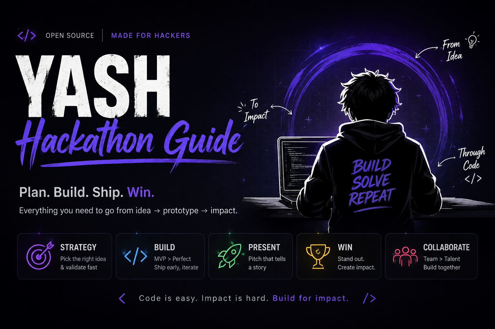
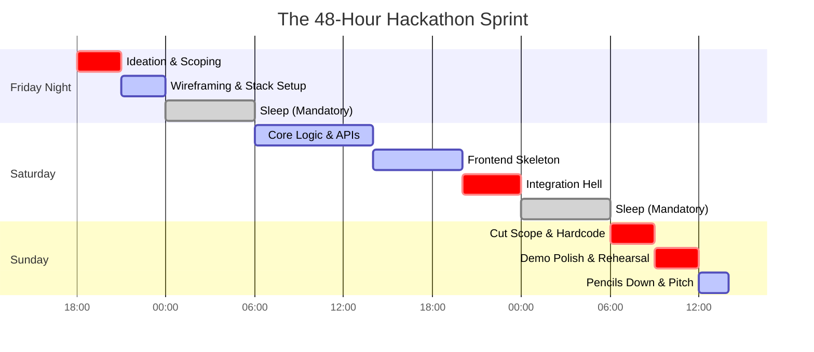

 

 # Yash Hackathon Guide
 

 

A highly opinionated playbook for shipping hackathon projects that don't suck. I cover how to select a stack, build the core logic in a weekend, and demo it without it crashing. Use it for any hackathon, any tech stack, any sponsor.

No bs. No theory. Just engineering pragmatism. Here is how you survive a 48-hour sprint without losing your mind or burning out.

---

## The Engineering Lifecycle

This is the exact timeline you need to follow if you actually want to ship working code:

<b>Click to expand the 48-Hour Sprint Timeline</b>

 

---

## Interactive Playbook Directory

<b>Click to explore the playbook</b>

 

### Core Strategy Guides
| Guide | What it covers |
|---|---|
| [**01: How to Pick an Idea**](docs/01-HOW-TO-PICK-AN-IDEA.md) | The Three Filters for choosing a winning idea fast. |
| [**02: Team & Planning**](docs/02-TEAM-AND-PLANNING.md) | Roles, timeline, and scoping for a 24-48hr build. |
| [**03: Judging & Pitching**](docs/03-JUDGING-AND-PITCHING.md) | What judges actually score, and how to hack the rubric. |
| [**04: Demo Playbook**](docs/04-DEMO-PLAYBOOK.md) | The Critical Path demo scripts, video tips, and faking it. |
| [**05: Tech Stack Cheatsheet**](docs/05-TECH-STACK-CHEATSHEET.md) | Fast, reliable stacks by project type (Boring = Better). |
| [**06: Common Mistakes**](docs/06-COMMON-MISTAKES.md) | The traps that sink otherwise-good projects. |
| [**07: How to Stand Out**](docs/07-HOW-TO-STAND-OUT.md) | Story-driven demos, showing the learning curve, and the LinkedIn test. |

### Idea Bank (40+ Projects)
| Category | Link |
|---|---|
| **Master Index** | [**Browse the full mindmap**](docs/ideas/00-IDEA-INDEX.md) |
| **Memory Agents** | [Sales](docs/ideas/09-memory-agents-sales.md) / [Marketing](docs/ideas/10-memory-agents-marketing.md) / [Engineering](docs/ideas/11-memory-agents-engineering.md) / [Ops](docs/ideas/12-memory-agents-operations.md) / [Product](docs/ideas/13-memory-agents-product.md) |
| **AI & Agents** | [Browse ideas](docs/ideas/02-ai-and-agents.md) |
| **Productivity** | [Browse ideas](docs/ideas/01-productivity-tools.md) |
| **Fintech** | [General](docs/ideas/03-fintech.md) / [AI Finance Projects](docs/ideas/14-ai-finance-projects.md) |
| **Health & Wellness** | [Browse ideas](docs/ideas/04-health-and-wellness.md) |
| **Climate & Impact** | [Browse ideas](docs/ideas/05-sustainability-and-climate.md) |
| **Education** | [Browse ideas](docs/ideas/06-education.md) |
| **Social Good** | [Browse ideas](docs/ideas/07-social-good-and-accessibility.md) |
| **Developer Tools** | [Browse ideas](docs/ideas/08-developer-tools.md) |

### Community
| Resource | Link |
|---|---|
| **Submit an Idea** | [Contributing Guide](CONTRIBUTING.md) |
| **Community Rules** | [Code of Conduct](CODE_OF_CONDUCT.md) |

---

## Quick Start Scenarios

**Scenario 1: You have 2 hours until kickoff and no idea what to build.**
Read [`01-HOW-TO-PICK-AN-IDEA.md`](docs/01-HOW-TO-PICK-AN-IDEA.md) for the framework, then head straight to the [Idea Index](docs/ideas/00-IDEA-INDEX.md) and steal something.

**Scenario 2: You have an idea, but you don't know who should do what.**
Read [`02-TEAM-AND-PLANNING.md`](docs/02-TEAM-AND-PLANNING.md) and assign the "Demo Driver" role immediately. 

**Scenario 3: You are stuck in "Integration Hell" with 6 hours left.**
Drop everything and read [`06-COMMON-MISTAKES.md`](docs/06-COMMON-MISTAKES.md). Cut scope, hardcode the backend if you have to, and save the demo.

**Scenario 4: Your project actually works and you want to win.**
Spend your last 3 hours exclusively on [`03-JUDGING-AND-PITCHING.md`](docs/03-JUDGING-AND-PITCHING.md) and [`04-DEMO-PLAYBOOK.md`](docs/04-DEMO-PLAYBOOK.md). The best code doesn't win; the best 3-minute pitch wins.

---

## Contributing

We want your winning ideas! If you built something at a hackathon that blew the judges away, add it to our Idea Index. 
Check out our [Contributing Guide](CONTRIBUTING.md) to get started.

---

## The One-Sentence Version

> Pick a real problem, scope it down until you can actually finish it, and spend your last few hours on the demo : not new features.

 <b>If this guide saved your weekend, drop a star on the repo!</b>

---

## License

MIT © [yashkoaprde](https://github.com/yashkoaprde)
