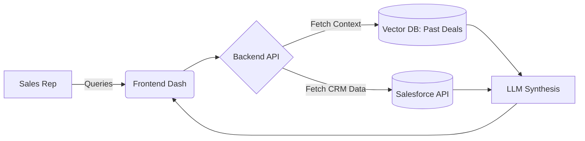
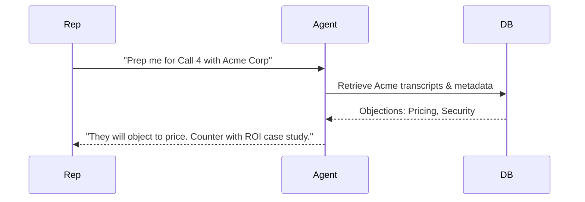
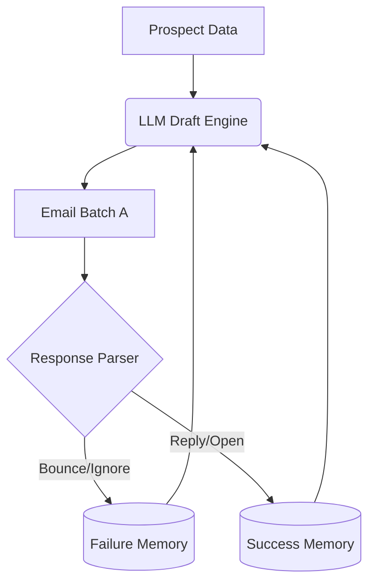
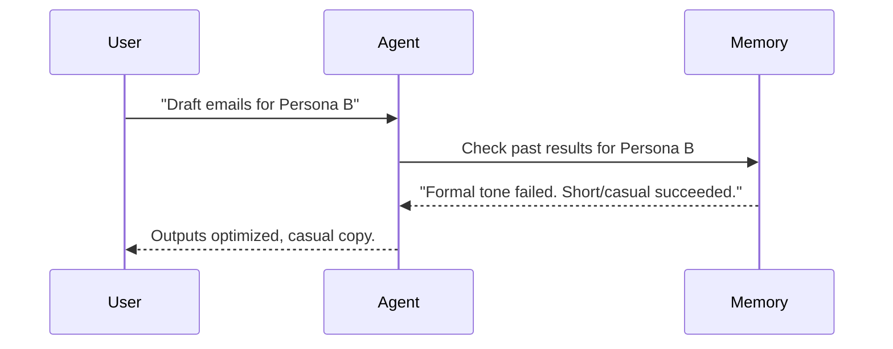
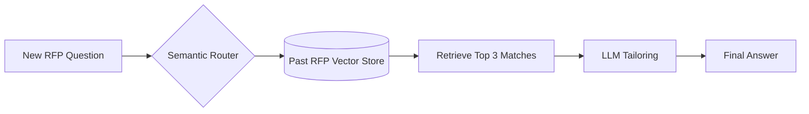
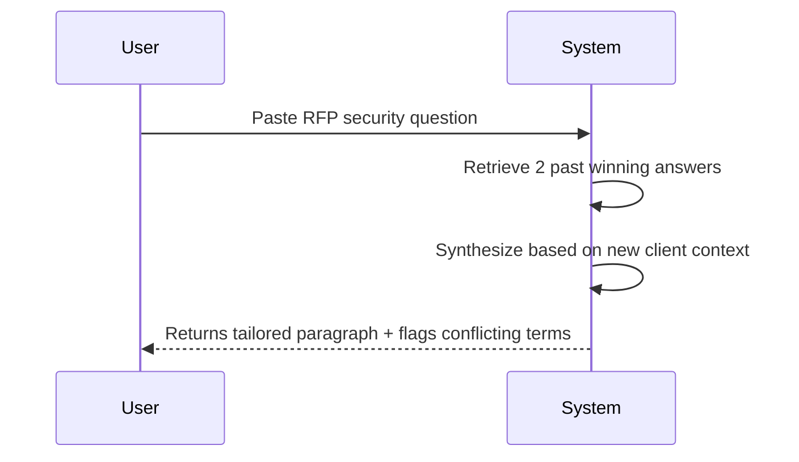

# Sales & Revenue Memory Agents

[← Idea Index](00-IDEA-INDEX.md)

## 1. Deal Intelligence Agent

**The Problem:** Sales reps waste hours reading CRM notes before calls. An agent with deal memory can brief a rep in seconds and suggest winning tactics based on past deals.

### System Architecture

### The Demo Execution

**Technical Scope & Anti-Patterns:**
* **Tech Stack:** Next.js, Pinecone (Vector DB), OpenAI API, mock CRM JSON data.
* **Advanced Scope:** Live webhook integration to auto-log objections post-call.
* **Anti-pattern:** Trying to build a live Zoom transcription integration. Stick to static logs.

---

## 2. Outbound Prospecting Agent

**The Problem:** Outbound is a numbers game, but personalization wins. An agent that remembers and adapts its approach across hundreds of prospects is a force multiplier.

### System Architecture

### The Demo Execution

**Technical Scope & Anti-Patterns:**
* **Tech Stack:** Python FastAPI, LangChain, Postgres for tracking state.
* **Advanced Scope:** Connects to LinkedIn API to fetch live persona data.
* **Anti-pattern:** Building a full email client. Just output the suggested copy.

---

## 3. Proposal & RFP Agent

**The Problem:** RFP responses are time sinks. An agent that remembers your best past answers and tailors them to each new opportunity saves days per proposal.

### System Architecture

### The Demo Execution

**Technical Scope & Anti-Patterns:**
* **Tech Stack:** React, FastAPI, ChromaDB, OpenAI.
* **Advanced Scope:** Flags conflicting SLA terms against past legal commitments.
* **Anti-pattern:** Generating a 50-page PDF. Just generate the raw text answers in the UI.

---
Maintained by [@yashkoaprde](https://github.com/yashkoaprde)
