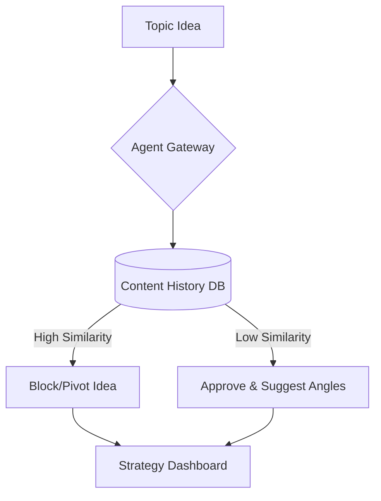
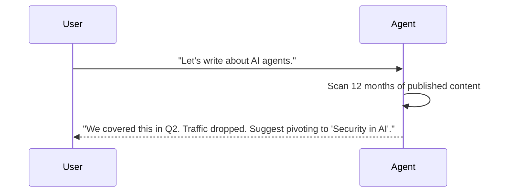
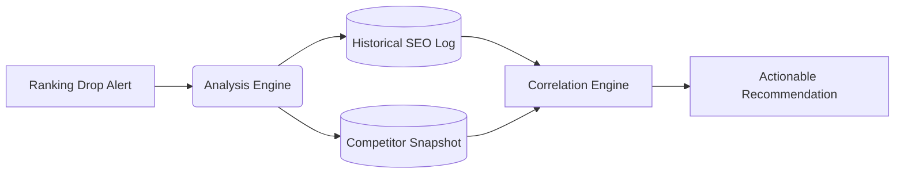
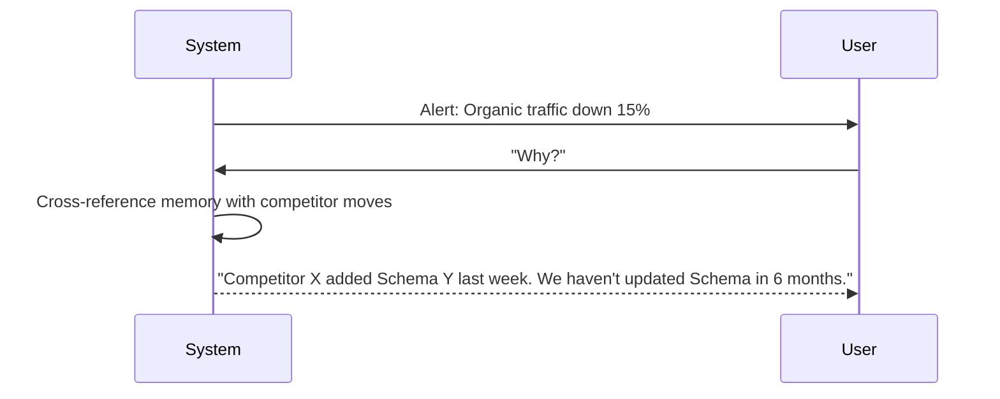
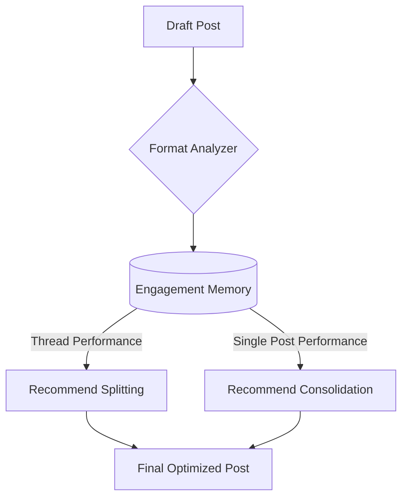
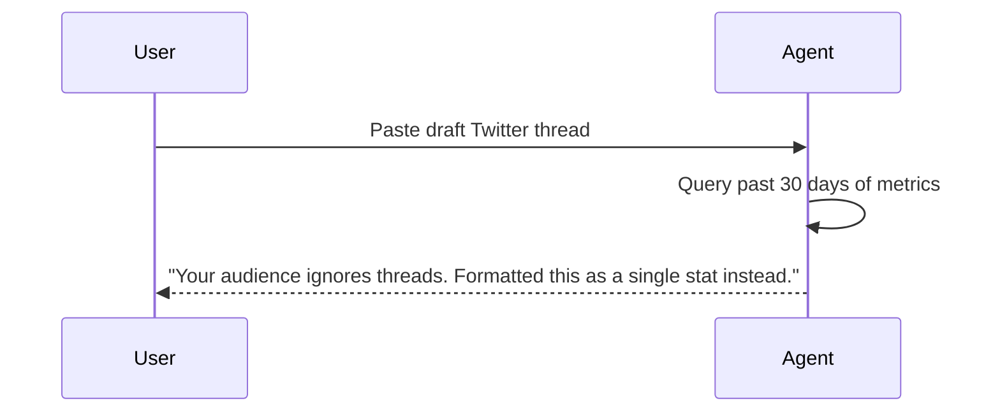

# Marketing & Content Memory Agents

[← Idea Index](00-IDEA-INDEX.md)

## 1. Content Strategy Agent

**The Problem:** Marketing teams constantly reinvent the wheel. An agent with content memory identifies what worked, what didn't, and where the gaps are.

### System Architecture

### The Demo Execution

**Technical Scope & Anti-Patterns:**
* **Tech Stack:** Vue.js, Node.js, Supabase, OpenAI embeddings.
* **Advanced Scope:** Auto-generates SEO metadata based on historically high-performing keywords.
* **Anti-pattern:** Building a CMS. Keep it as a standalone strategy dashboard.

---

## 2. SEO & Citation Agent

**The Problem:** SEO is a long game. An agent that remembers the full history of optimization efforts and outcomes makes smarter recommendations than a one-shot analysis.

### System Architecture

### The Demo Execution

**Technical Scope & Anti-Patterns:**
* **Tech Stack:** React, Python, SQLite (for historical snapshot storage).
* **Advanced Scope:** Monitors competitor sitemaps hourly and alerts via Slack.
* **Anti-pattern:** Crawling the whole internet live. Hardcode the historical SEO data.

---

## 3. Social Media Engagement Agent

**The Problem:** Every brand's audience is different. An agent that learns YOUR audience's specific timing and format preferences over weeks is incredibly valuable.

### System Architecture

### The Demo Execution

**Technical Scope & Anti-Patterns:**
* **Tech Stack:** Next.js frontend, Python FastAPI backend, Postgres.
* **Advanced Scope:** Remembers specific high-value followers and suggests personalized reply copy.
* **Anti-pattern:** Trying to build auto-posting API logic. Just show the generated insight.

---
Maintained by [@yashkoaprde](https://github.com/yashkoaprde)
