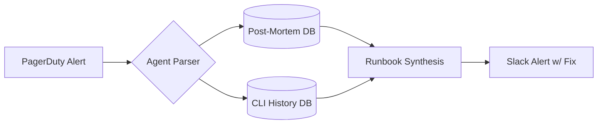
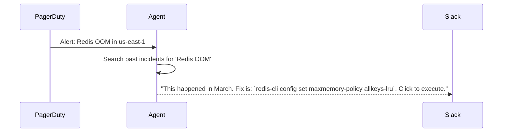
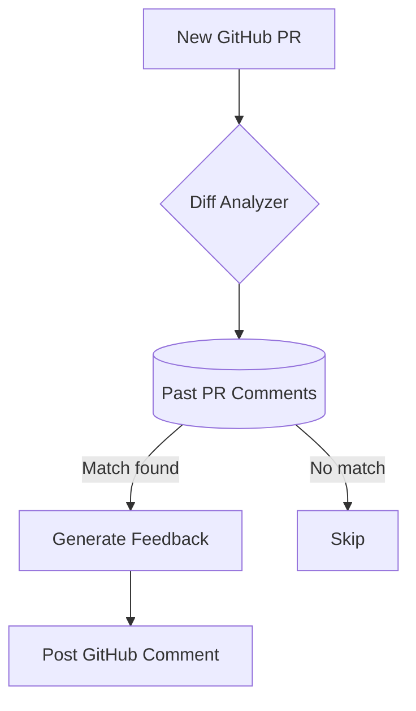
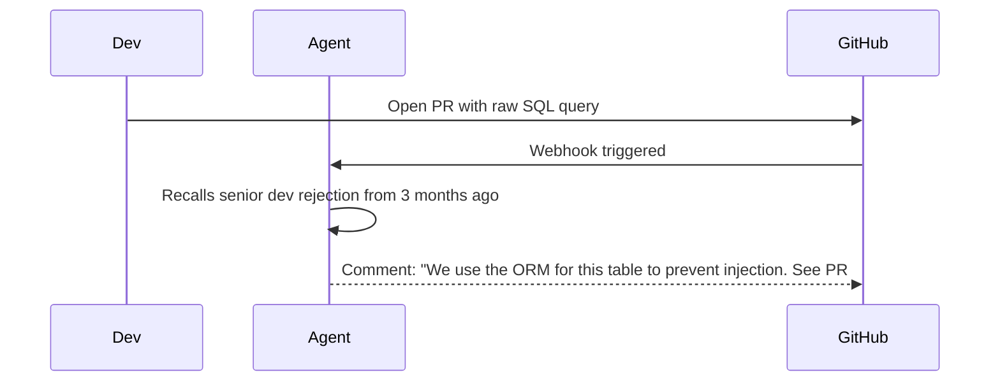
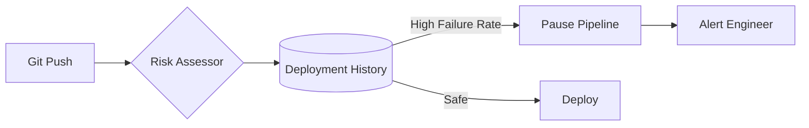
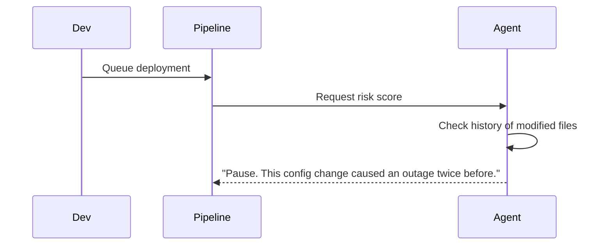

# Engineering & DevOps Memory Agents

[← Idea Index](00-IDEA-INDEX.md)

## 1. Incident Response Agent

**The Problem:** When prod is down, every minute counts. An agent that recalls exactly how similar incidents were resolved before is invaluable.

### System Architecture

### The Demo Execution

**Technical Scope & Anti-Patterns:**
* **Tech Stack:** Go, Slack Bolt API, SQLite, OpenAI.
* **Advanced Scope:** Integrates with Datadog APIs to auto-ingest logs.
* **Anti-pattern:** Trying to build an auto-remediation tool. Just suggest the fix, let a human execute.

---

## 2. Code Review Agent

**The Problem:** Code review is slow and inconsistent. An agent that knows your codebase's patterns and team's conventions catches issues a generic linter never would.

### System Architecture

### The Demo Execution

**Technical Scope & Anti-Patterns:**
* **Tech Stack:** Python, GitHub Apps API, Qdrant (Vector DB).
* **Advanced Scope:** Generates the exact diff to fix the issue based on past accepted code.
* **Anti-pattern:** Building a generic linter. This needs to demonstrate *historical team context*.

---

## 3. DevOps Pipeline Agent

**The Problem:** Agent tracks deployment history, build failures, and infrastructure changes to predict risks before they hit production.

### System Architecture

### The Demo Execution

**Technical Scope & Anti-Patterns:**
* **Tech Stack:** Node.js, GitHub Actions integration, MongoDB.
* **Advanced Scope:** Builds a risk-score matrix for every PR.
* **Anti-pattern:** Rebuilding GitHub Actions. Just build the risk analysis layer.

---
Maintained by [@yashkoaprde](https://github.com/yashkoaprde)
