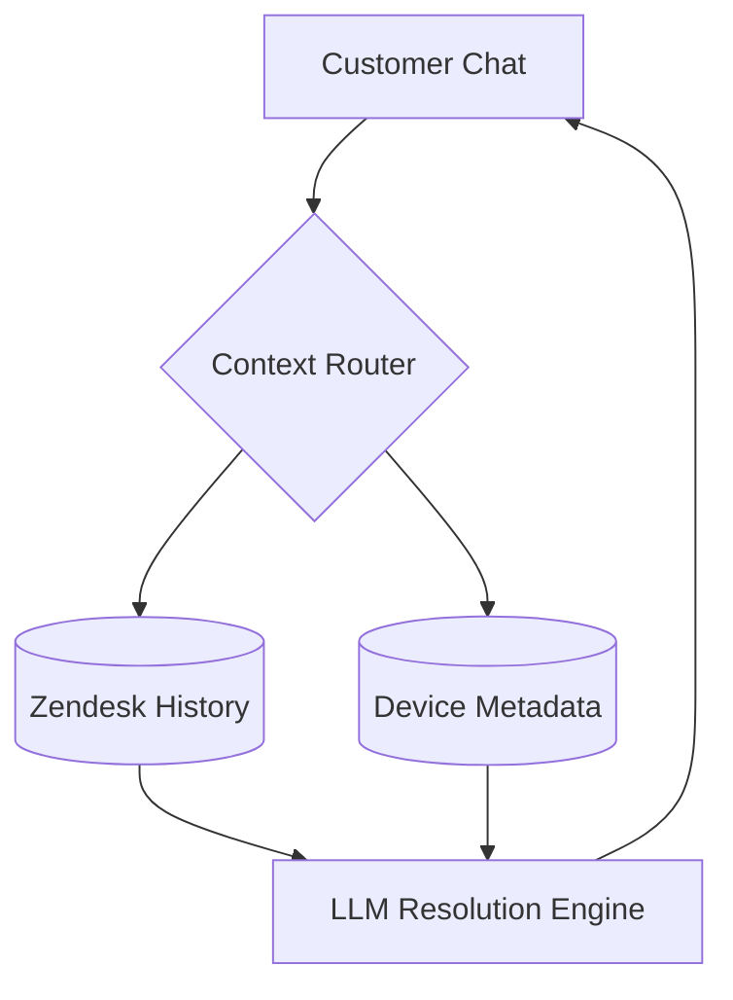
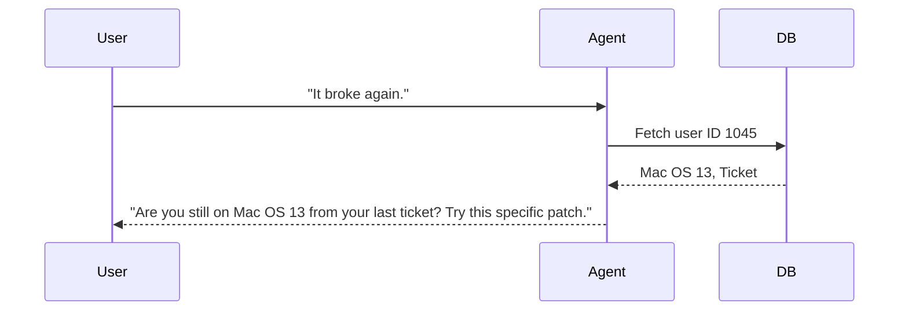
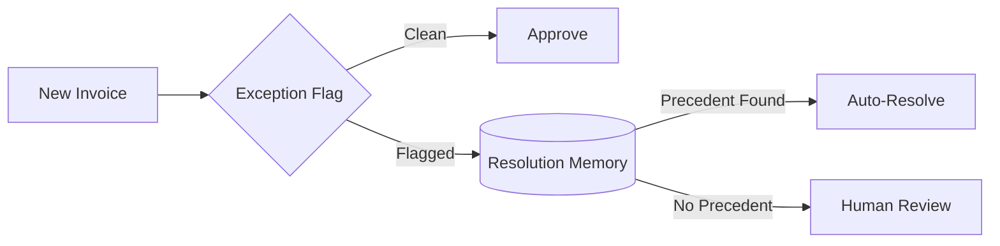
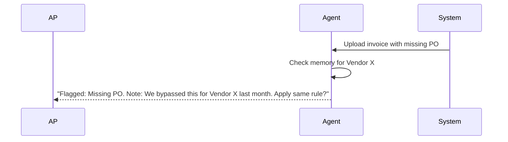
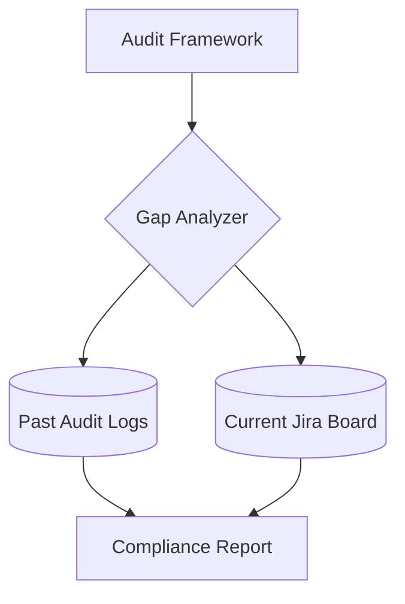
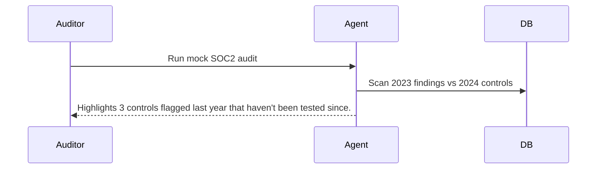

# Operations & Support Memory Agents

[← Idea Index](00-IDEA-INDEX.md)

## 1. Customer Support Agent

**The Problem:** Nothing angers a customer more than repeating their story. An agent with full customer memory transforms the entire support experience.

### System Architecture

### The Demo Execution

**Technical Scope & Anti-Patterns:**
* **Tech Stack:** React, Node.js, Pinecone, Zendesk dummy data.
* **Advanced Scope:** Analyzes frustration level across 5 past tickets and escalates immediately to tier-3.
* **Anti-pattern:** Building a generic chatbot. The demo must prove cross-ticket memory.

---

## 2. Accounts Payable Agent

**The Problem:** AP teams process thousands of invoices with recurring edge cases. An agent handles exceptions that would normally require senior staff.

### System Architecture

### The Demo Execution

**Technical Scope & Anti-Patterns:**
* **Tech Stack:** Python, FastAPI, SQLite, OCR (Tesseract/AWS Textract).
* **Advanced Scope:** Integrates with OCR to extract line items directly from PDF invoices.
* **Anti-pattern:** Building a full ERP system. Just build the exception-handling memory layer.

---

## 3. Compliance & Audit Agent

**The Problem:** An agent that remembers your full audit history and can flag gaps before auditors find them is immediately valuable.

### System Architecture

### The Demo Execution

**Technical Scope & Anti-Patterns:**
* **Tech Stack:** Next.js, Go, Postgres.
* **Advanced Scope:** Auto-generates compliance evidence reports based on historical Jira ticket metadata.
* **Anti-pattern:** Trying to parse full SOC2 PDFs live. Hardcode the historical audit data for the demo.

---
Maintained by [@yashkoaprde](https://github.com/yashkoaprde)
