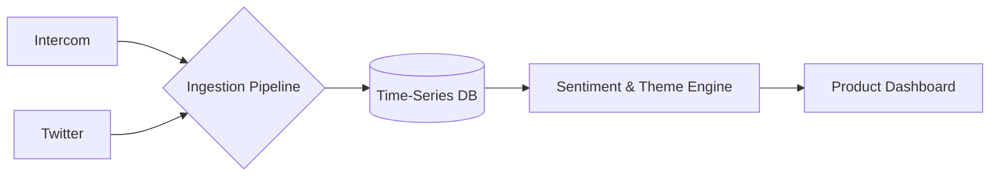
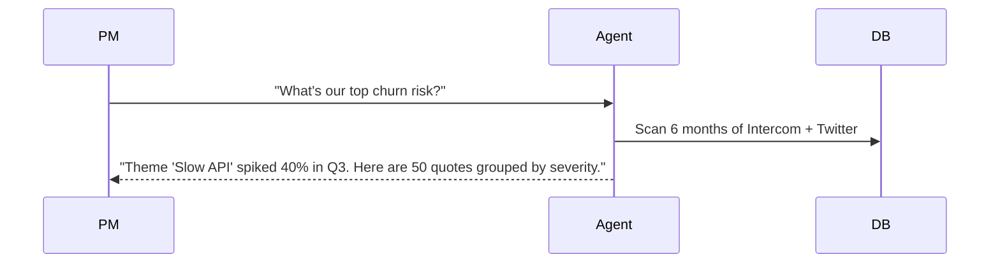
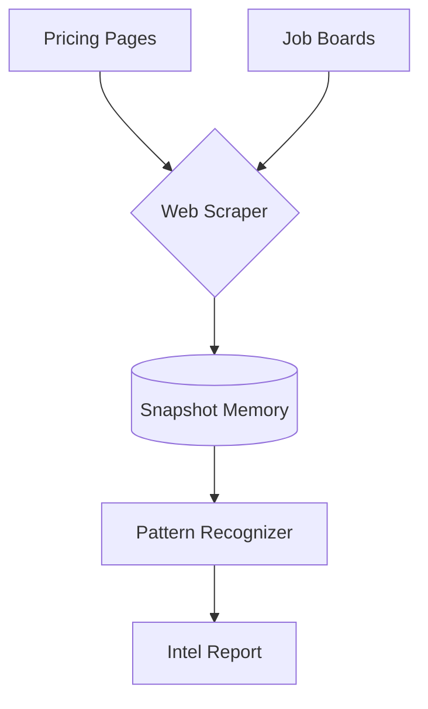
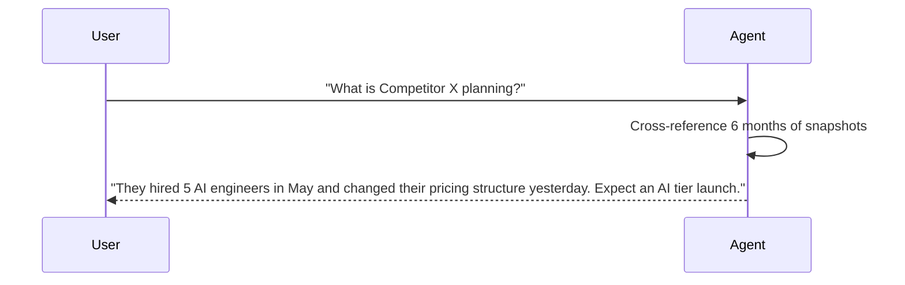
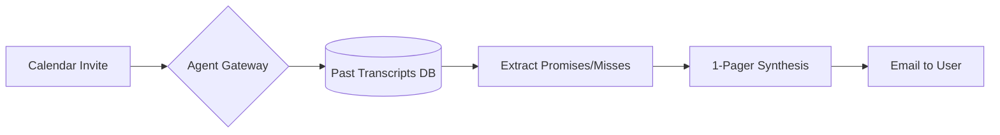
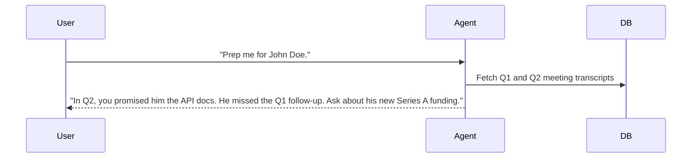

# Product & Strategy Memory Agents

[← Idea Index](00-IDEA-INDEX.md)

## 1. User Feedback Synthesizer

**The Problem:** Product teams drown in feedback. An agent that connects dots across channels and time spots patterns humans miss.

### System Architecture

### The Demo Execution

**Technical Scope & Anti-Patterns:**
* **Tech Stack:** React, Python, InfluxDB or TimescaleDB.
* **Advanced Scope:** Agent automatically drafts a PRD (Product Requirements Document) for the most requested feature.
* **Anti-pattern:** Building a simple summarizer. It must track *shifts over time* to prove memory.

---

## 2. Competitive Intelligence Agent

**The Problem:** Competitive intelligence is only useful if it is cumulative. An agent that remembers six months of competitor activity spots patterns a weekly check never would.

### System Architecture

### The Demo Execution

**Technical Scope & Anti-Patterns:**
* **Tech Stack:** Node.js, Puppeteer/Cheerio, Postgres JSONb.
* **Advanced Scope:** Scrapes live competitor subreddits to cross-reference customer complaints with their feature releases.
* **Anti-pattern:** Building a web scraper. The value is the historical synthesis, not the scraping.

---

## 3. Meeting Prep Agent

**The Problem:** An agent that briefs you with full context from every past interaction with a contact is a professional superpower.

### System Architecture

### The Demo Execution

**Technical Scope & Anti-Patterns:**
* **Tech Stack:** Vue.js, FastAPI, ChromaDB, Google Calendar API.
* **Advanced Scope:** Integrates with Zoom transcript APIs to automatically append new promises post-meeting.
* **Anti-pattern:** Building a generic meeting transcriber. The wow factor is the pre-meeting historical recall.

---
Maintained by [@yashkoaprde](https://github.com/yashkoaprde)
