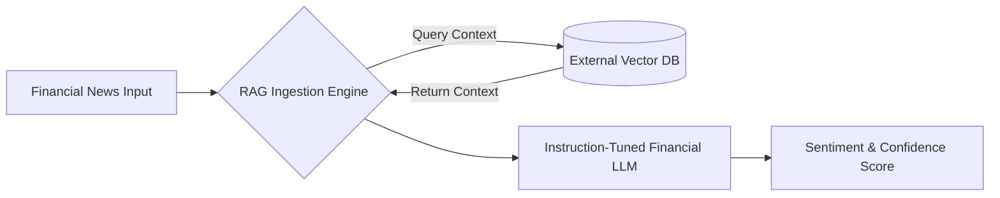
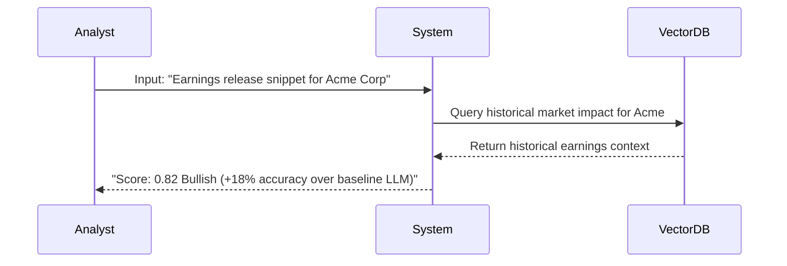
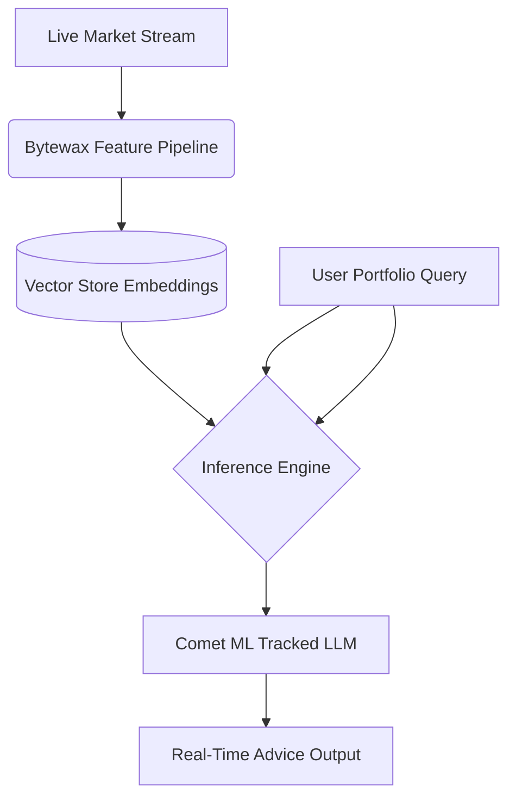
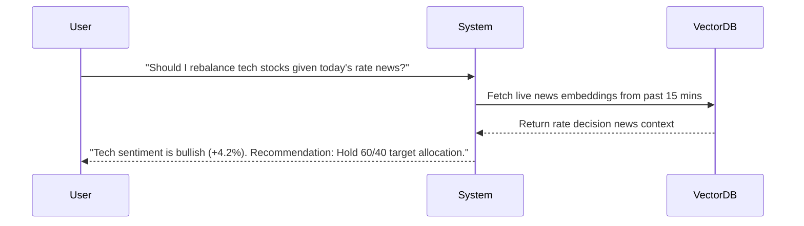
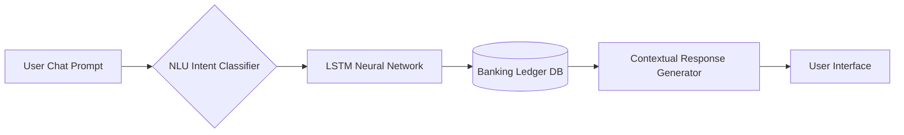
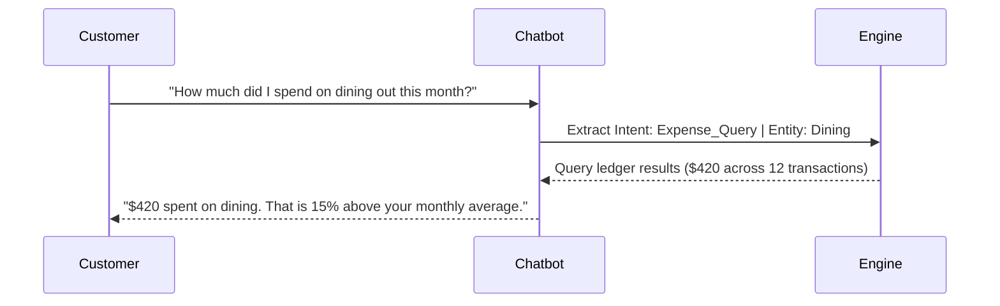
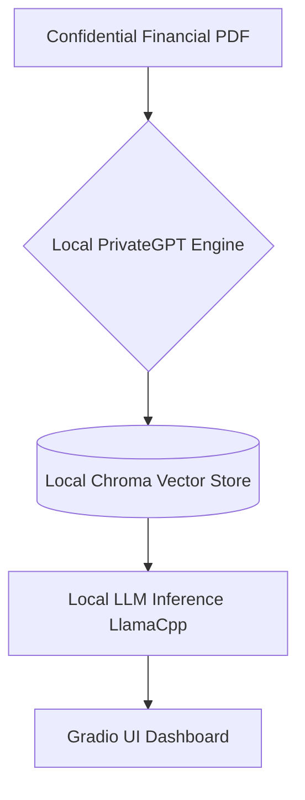
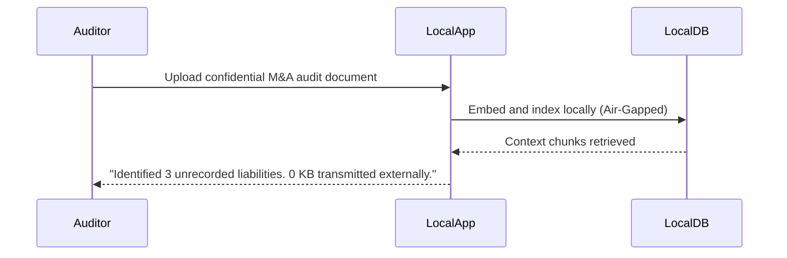
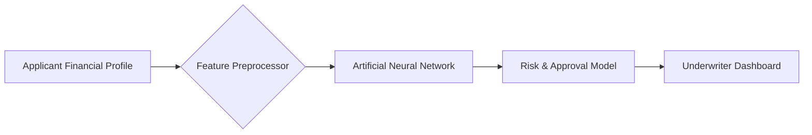
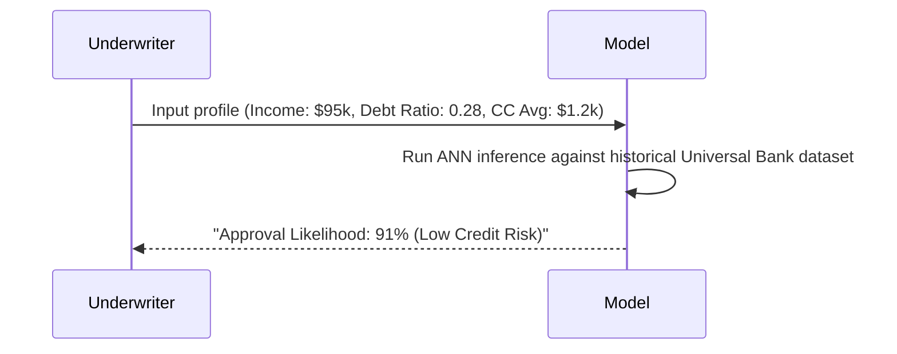

# AI Finance Projects

[← Idea Index](00-IDEA-INDEX.md)

## 1. Financial Sentiment Analysis Using RAG LLMs

**The Problem:** Financial news is brief, dense, and context-poor. Base LLMs misjudge market sentiment without real-time external context retrieval. Combining instruction-tuned LLMs with retrieval augmentation yields significant accuracy gains over standard models.

### System Architecture

### The Demo Execution

**Technical Scope & Anti-Patterns:**
*   **Tech Stack:** Python, FinBERT / LLaMA-3, ChromaDB, Hugging Face Transformers.
*   **Advanced Scope:** Live RSS stream integration from financial news feeds with real-time sentiment scoring.
*   **Anti-pattern:** Relying solely on base ChatGPT prompt engineering without a RAG retrieval layer.

---

## 2. Real-Time Financial Advisor LLM System

**The Problem:** Generic AI advice lacks live market awareness. Traders and investors need real-time data streaming paired with fine-tuned advice models.

### System Architecture

### The Demo Execution

**Technical Scope & Anti-Patterns:**
*   **Tech Stack:** Bytewax, Qdrant/Milvus, Comet ML, LangChain, GPT-3.5/4 fine-tuned.
*   **Advanced Scope:** Automated trade execution simulation using Alpaca API sandbox.
*   **Anti-pattern:** Polling news APIs synchronously inside request handlers instead of using a streaming feature pipeline.

---

## 3. Smart NLU Chatbot for Personal Banking

**The Problem:** Banking apps obscure wallet details and spending patterns behind complex navigation menus. Users need instant NLU-driven intent resolution.

### System Architecture

### The Demo Execution

**Technical Scope & Anti-Patterns:**
*   **Tech Stack:** TensorFlow / Keras, Python FastAPI, React, SQLite/Postgres.
*   **Advanced Scope:** Predictive spending alerts using time-series forecasting for upcoming bills.
*   **Anti-pattern:** Hardcoding rigid regex rules instead of using neural NLU classification.

---

## 4. Local Private RAG for Sensitive Financial Documents

**The Problem:** Financial institutions cannot upload sensitive client records, M&A docs, or audit logs to public cloud LLM endpoints due to compliance laws.

### System Architecture

### The Demo Execution

**Technical Scope & Anti-Patterns:**
*   **Tech Stack:** PrivateGPT, LlamaCpp, ChromaDB, SentenceTransformers, Gradio.
*   **Advanced Scope:** Automated PII and account number redaction prior to vector indexing.
*   **Anti-pattern:** Routing any API requests to external third-party LLM endpoints.

---

## 5. Bank Loan Prediction Engine

**The Problem:** Manual loan evaluation is slow, inconsistent, and prone to human bias. Institutions need transparent, data-driven credit risk assessment.

### System Architecture

### The Demo Execution

**Technical Scope & Anti-Patterns:**
*   **Tech Stack:** Python, TensorFlow / Keras, Pandas, Scikit-Learn, Streamlit.
*   **Advanced Scope:** SHAP / LIME explainability integration to display top feature drivers behind approval decision.
*   **Anti-pattern:** Using simple unweighted decision trees without proper feature normalization.

---
Maintained by [@yashkoaprde](https://github.com/yashkoaprde)
